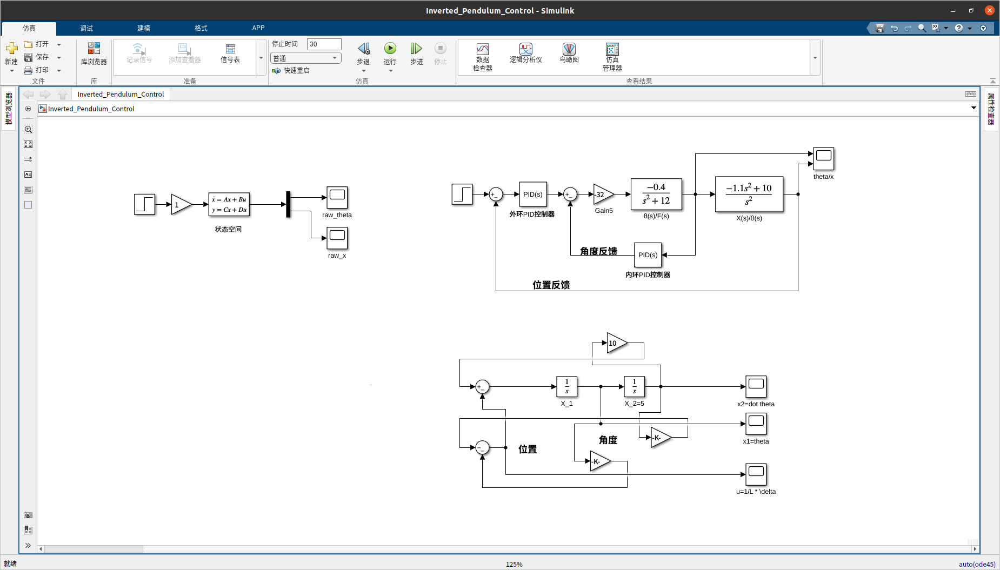

# 倒立摆控制系统项目

## 项目背景

倒立摆控制系统是一个经典的控制理论问题，广泛应用于机器人、航空航天和自动化等领域。本项目旨在通过 MATLAB 和 Simulink 实现倒立摆的 PID 和 LQR 控制器设计，并进行仿真测试。

## 项目目标

1. 建立倒立摆系统的状态空间模型。
2. 设计 PID 控制器和 LQR 控制器(TODO)。
3. 使用 MATLAB 和 Simulink 进行仿真测试(TODO)。

## 项目结构与使用
结构大概是:
```plaintext
├── code
│   ├── Inverted_Pendulum_Control.slx
│   ├── LQR.m
│   ├── PID.m
│   ├── test2.m
│   └── test.m
├── imgs
│   ├── figure1.png
│   ├── figure2.png
│   └── image.png
├── README.md
├── tex.pdf
├── tex.tex
```
可以直接运行**code**下的**First-order-Inverted-pendulum.slx**文件，也可以直接运行**code**下的**LQR.m**与**PID.m**文件。
为了更好的阅读体验，请参考**tex.pdf**文件。
## 数学推导与模型构建
### 一般的形式

我们这里还要考虑进来阻尼系数 $b$，那么我们现在的方程就变成了:

\[
\left\{\begin{matrix}
    (M+m)\ddot{x}+b\dot{x}+ml\ddot{\theta} = u \\
    ml\ddot{x}+(I+ml^2)\ddot{\theta} = mgl\theta \\
\end{matrix}
\right.
\]

那么在添加了阻尼系数之后，我们更一般的表达式应该是:

\[\begin{bmatrix}
\dot{x_1}\\\dot{x_2}\\\dot{x_3}\\\dot{x_4}    
\end{bmatrix}
=\begin{bmatrix}
0&1&0&0\\
\frac{mgl(M+m)}{p}&-\frac{(I+ml^2)b}{p}&0&0\\
0&0&0&1\\
-\frac{m^2gl^2}{p}&-\frac{mlb}{p}&0&0
\end{bmatrix}\cdot
\begin{bmatrix}
    x_1\\x_2\\x_3\\x_4
\end{bmatrix} + 
\begin{bmatrix}
0\\
-\frac{ml}{p}\\
0\\
\frac{I+ml^2}{p}
\end{bmatrix}\cdot u \]

\[
y=CX+D\hat{u}=\begin{bmatrix}
    1&0&0&0\\
    0&0&1&0
\end{bmatrix} \cdot
\begin{bmatrix}
    x_1\\x_2\\x_3\\x_4
\end{bmatrix}+\begin{bmatrix}
    0\\0
\end{bmatrix}\cdot \hat{u}=
\begin{bmatrix}
   \theta \\ x
\end{bmatrix}
\]

其中，$p=I(M+m)+Mml^2$，当然还有 $q=(M+m)(I+ml^2)-(ml)^2$，在后面 PID 调节的时候可以使用。

## 控制环节

### LQR 控制

已知系统状态空间模型:

\[
\dot{X}=AX+Bu
\]

其中 $X$ 为状态向量，$u$ 为控制输入，$A$ 为状态矩阵，$B$ 为输入矩阵。

LQR 控制考虑最佳控制向量的矩阵 $K$:

\[
u=-KX
\]

其中 $K$ 为增益矩阵，$X$ 为状态向量。

那么 LQR 控制的目标转换为确定下列最小化二次型函数:

\[
J=\frac{1}{2}\int_{0}^{T}(X^TQX+u^TRu)dt
\]

此时不妨选择 $Q=I,R=I$，使用 MATLAB 代码求解得到增益矩阵 $K$:

```matlab
A = [0, 1, 0, 0;
    41.63, 0, 0, 0;
    0, 0, 0, 1;
    -0.6099, 0, 0, 0];
B = [0;
    -2.7584;
    0;
    0.6898];
Q=eye(4);
R=eye(1);
[K, S, E] = lqr(A, B, Q, R);
```
### PID 控制

进行 Laplace 变换，同时假设 $\theta,\dot{\theta}$ 很小，根据上述推导不难有如下式子:

\[
\left\{\begin{matrix}
    (M+m)\ddot{x}+ml\ddot{\theta}\cos\theta -ml\dot{\theta}^2\sin\theta + b\dot{x} = u \\
    ml\ddot{x}\cos\theta+(I+ml^2)\ddot{\theta}-mgl\sin\theta = 0 \\
\end{matrix}
\right.
\]

有初始状态为 0，而且 $\sin\theta=\theta,\cos\theta=1,\dot{\theta}=0$:

\[
(I+ml^2)\Phi(s)s^2-mgl\Phi(s)=mlX(s)s^2-ml\Phi(s)s^2+bX(s)s=U(s)
\]

那么可以给出两种传递函数:

\[
P_\text{pend}(s)=\frac{\Phi(s)}{U(s)}=\frac{mls}{((M+m)(I+ml^2)-(ml)^2)s^3+b(I+ml^2)s^2-(M+m)mgls-bmgl}
\]

\[
P_\text{cart}(s)=\frac{X(s)}{U(s)}=\frac{(I+ml^2)s^2-mgl}{((M+m)(I+ml^2)-(ml^2))s^4+b(I+ml^2)s^3-(M+m)mgls^2-bmgls}
\]

这样关于角度和关于小车位移的传递函数就有了，可以进行 PID 控制仿真了。

## MATLAB 代码与 Simulink 仿真测试

### MATLAB 代码

```matlab
% 定义系统参数
M = 1.42;  
m = 0.12;
b = 0.1;     % 阻尼系数
I = 0.014;     % 转动惯量
g = 9.8;
L = 0.188;
q = (M+m)*(I+m*L^2)-(m*L)^2;
s = tf('s');

% 定义传递函数
P_cart = (((I+m*L^2)/q)*s^2 - (m*g*L/q))/(s^4 + (b*(I + m*L^2))*s^3/q - ((M + m)*m*g*L)*s^2/q - b*m*g*L*s/q);
P_pend = (m*L*s/q)/(s^3 + (b*(I + m*L^2))*s^2/q - ((M + m)*m*g*L)*s/q - b*m*g*L/q);

% 设置输入输出名称
sys_tf = [P_cart ; P_pend];
inputs = {'u'};
outputs = {'x'; 'phi'};
set(sys_tf,'InputName',inputs);
set(sys_tf,'OutputName',outputs);

% 设计 PID 控制器
Kp_phi = 100;
Ki_phi = 1;
Kd_phi = 30;
C_phi = pid(Kp_phi, Ki_phi, Kd_phi);

Kp_x = 10;
Ki_x = 0.1;
Kd_x = 0.3;
C_x = pid(Kp_x, Ki_x, Kd_x);

% 构建闭环系统
T1 = feedback(P_pend, C_phi);
T2 = feedback(1, P_pend * C_phi) * P_cart;
T2 = feedback(T2, C_x);

% 仿真
t = 0:0.01:5;

% 绘制角度响应
figure;
subplot(2, 1, 1);
impulse(T1, t);
ylim([-0.05, 0.05]);
title('角度响应');
grid on;

% 绘制位移响应
subplot(2, 1, 2);
impulse(T2, t);
xlim([0, 1.5]);
title('位移响应');
grid on;

set(gcf, 'Position', [100, 100, 800, 600]);
```

### Simulink 仿真测试
TODO


## 参考文献

1. [Control System Design by Karl J. Åström and Björn Wittenmark](https://www.springer.com/gp/book/9780387951768)
