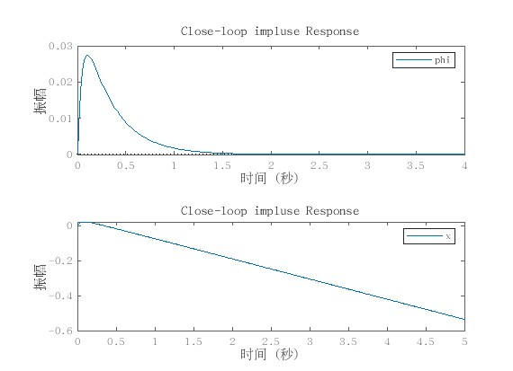
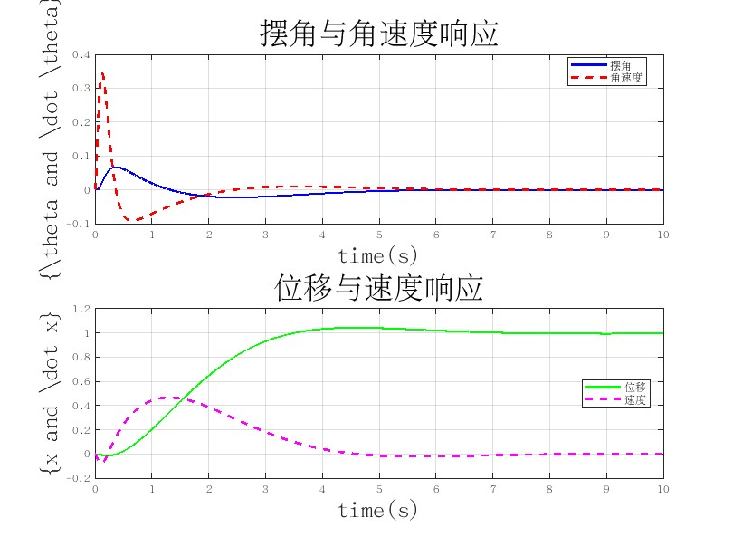
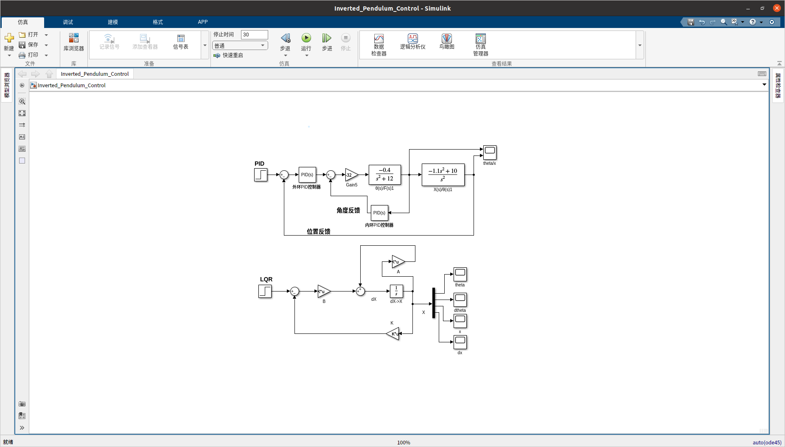
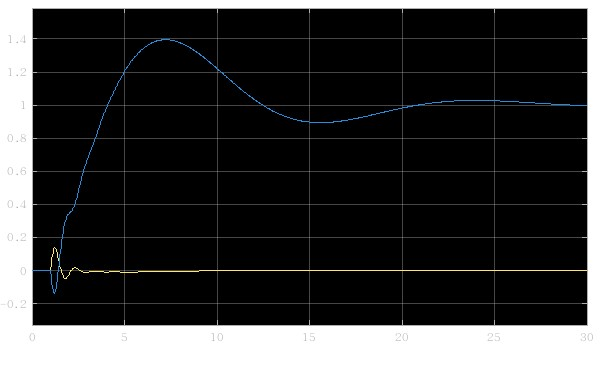
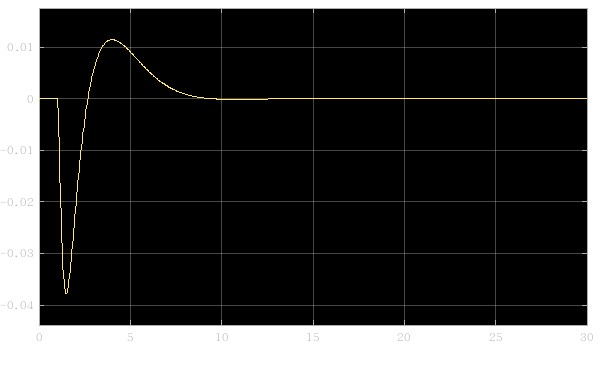
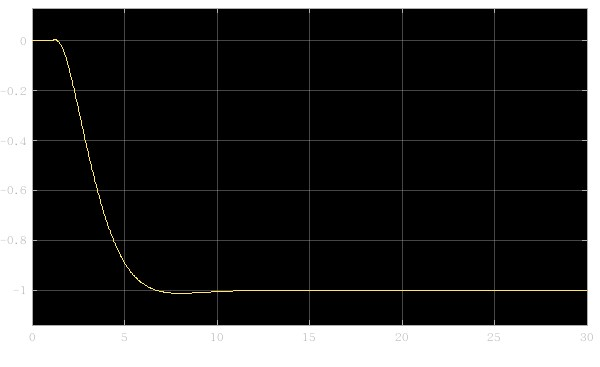

# 倒立摆控制系统项目

## 项目背景

倒立摆控制系统是一个经典的控制理论问题，广泛应用于机器人、航空航天和自动化等领域。本项目旨在通过 MATLAB 和 Simulink 实现倒立摆的 PID 和 LQR 控制器设计，并进行仿真测试。

## 项目目标

1. 建立倒立摆系统的状态空间模型。
2. 设计 PID 控制器和 LQR 控制器。
3. 使用 MATLAB 和 Simulink 进行仿真测试。

## 项目结构与使用
结构大概是:
```plaintext
├── code/
│   ├── Inverted_Pendulum_Control.slx
│   ├── LQR.m
│   ├── PID.m
│   ├── test2.m
│   └── test.m
├── imgs/
├── README.md
├── tex.pdf
├── tex.tex
```
可以直接运行**code**下的**First-order-Inverted-pendulum.slx**文件，也可以直接运行**code**下的**LQR.m**与**PID.m**文件。
**test.m**与**test2.m**文件是理论测试文件，可以用来测试仿真结果的正确性。
为了更好的阅读体验，请参考**tex.pdf**文件。
## 数学推导与模型构建
请参考**tex.tex**文件。
## MATLAB 代码与 Simulink 仿真测试

### MATLAB 代码
#### PID 控制器设计
```matlab
% 定义系统参数
M = 1.42;  
m = 0.12;
b = 0.1;     % 阻尼系数
I = 0.014;     % 转动惯量
g = 9.8;
L = 0.188;
q = (M+m)*(I+m*L^2)-(m*L)^2;
s = tf('s');
% 定义传递函数
P_cart = (((I+m*L^2)/q)*s^2 - (m*g*L/q))/(s^4 + (b*(I + m*L^2))*s^3/q - ((M + m)*m*g*L)*s^2/q - b*m*g*L*s/q);
P_pend = (m*L*s/q)/(s^3 + (b*(I + m*L^2))*s^2/q - ((M + m)*m*g*L)*s/q - b*m*g*L/q);
% 设置输入输出名称
sys_tf = [P_cart ; P_pend];
inputs = {'u'};
outputs = {'x'; 'phi'};
set(sys_tf,'InputName',inputs);
set(sys_tf,'OutputName',outputs);
% 设计 PID 控制器
Kp_phi = 100;
Ki_phi = 1;
Kd_phi = 30;
C_phi = pid(Kp_phi, Ki_phi, Kd_phi);
Kp_x = 10;
Ki_x = 0.1;
Kd_x = 0.3;
C_x = pid(Kp_x, Ki_x, Kd_x);
% 构建闭环系统
T1 = feedback(P_pend, C_phi);
T2 = feedback(1, P_pend * C_phi) * P_cart;
T2 = feedback(T2, C_x);
% 仿真
t = 0:0.01:5;
% 绘制角度响应
figure;
subplot(2, 1, 1);
impulse(T1, t);
ylim([-0.05, 0.05]);
title('角度响应');
grid on;
% 绘制位移响应
subplot(2, 1, 2);
impulse(T2, t);
xlim([0, 1.5]);
title('位移响应');
grid on;
set(gcf, 'Position', [100, 100, 800, 600]);
```

#### LQR控制器设置
```matlab
% 定义状态矩阵 A 和控制矩阵 B 观测矩阵 C 和输入矩阵 D
A = [0, 1, 0, 0;
     41.63, 0, 0, 0;
     0, 0, 0, 1;
     -0.6099, 0, 0, 0];
B = [0;
     -2.7584;
     0;
     0.6898];
C = [1, 0, 0, 0;
     0, 0, 1, 0];
D = 0;
G = ss(A, B, C, D);
% 定义权重矩阵 Q 和 R
Q = eye(4);  % 状态权重矩阵，这里使用单位矩阵
R = 1;       % 控制权重矩阵，这里使用 1
[K, S, E] = lqr(A, B, Q, R);
% 构建闭环系统
A_cl = A - B * K;
B_cl = B;
C_cl = C;
D_cl = D;
Gclose = ss(A_cl, B_cl, C_cl, D_cl);

% 计算并绘制阶跃响应
t = 0:0.01:10;
[y, t, x] = step(Gclose, t);

figure;
% 摆角与角速度响应
subplot(2, 1, 1);
plot(t, x(:, 1), 'b-', 'LineWidth', 2);
hold on;
plot(t, x(:, 2), 'r--', 'LineWidth', 2);
grid on;
xlabel('time(s)', 'FontSize', 20);
ylabel('{\theta and \dot \theta}', 'FontSize', 20);
title('摆角与角速度响应', 'FontSize', 25);
legend('摆角', '角速度');
% 位移与速度响应
subplot(2, 1, 2);
plot(t, x(:, 3), 'g-', 'LineWidth', 2);
hold on;
plot(t, x(:, 4), 'm--', 'LineWidth', 2);
grid on;
xlabel('time(s)', 'FontSize', 20);
ylabel('{x and \dot x}', 'FontSize', 20);
title('位移与速度响应', 'FontSize', 25);
legend('位移', '速度');
set(gcf, 'Position', [100, 100, 800, 600]);
```

### Simulink 仿真测试

这是PID输出结果:

这是LQR的simulink仿真结果:


## 参考文献

1. [Control System Design by Karl J. Åström and Björn Wittenmark](https://www.springer.com/gp/book/9780387951768)
2. [一阶倒立摆的PID控制和LQR控制](https://zhuanlan.zhihu.com/p/54071212)
3. [基于 MWORKS 的一维倒立摆状态反馈控制律设计与验证](https://zhuanlan.zhihu.com/p/565861449)
4. [Matlab_lqr_fucntion](https://ww2.mathworks.cn/help/control/ref/lti.lqr.html)